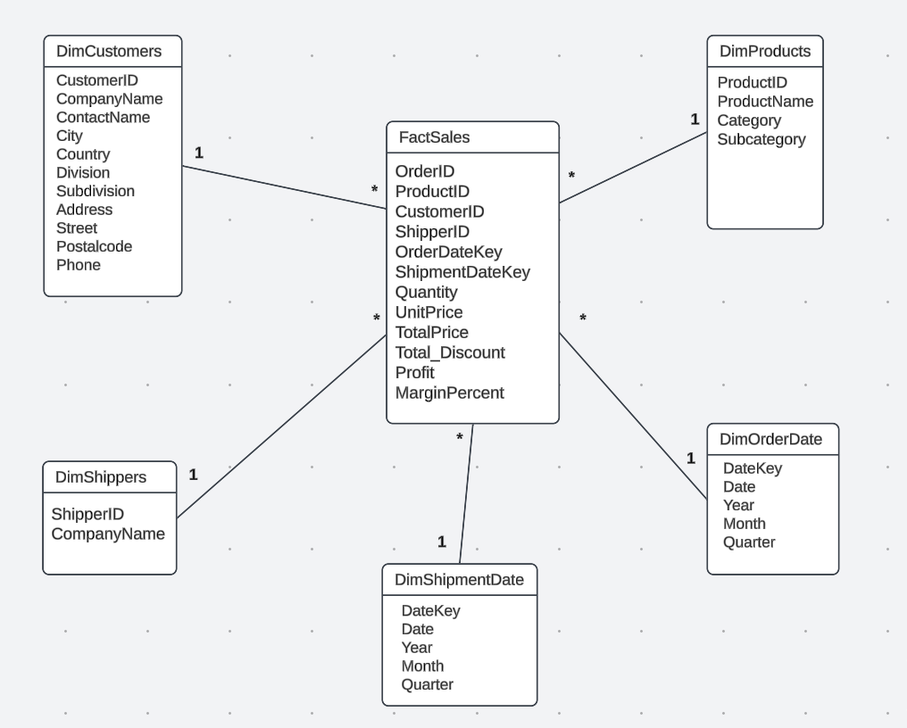

# Medallion Architecture Sales Data Pipeline

> Using the Medallion Architecture to aggregate sales data and surface insights for performance analysis.

## Project Overview

## 🧠 Project Overview

This project demonstrates the design and implementation of a scalable **ETL data pipeline** using the **Medallion Architecture** on **Databricks**, with an emphasis on applying **SQL**, **Spark**, and structured data modeling best practices.

The goal is to ingest, clean, transform, and aggregate retail sales data in order to support performance analysis across products and stores.

The source dataset is provided in an Excel file containing **eight sheets**, each representing a separate table.  
📄 [View the source `.xlsx` file](medallion-architecture-data-pipeline/resources)

Each sheet was parsed and loaded into Databricks as an individual Spark DataFrame. The pipeline was then built as follows:

- **Bronze Layer**: Ingests raw CSV data into Delta tables with minimal transformation.
- **Silver Layer**: Applies data cleaning, normalization, and enrichment using PySpark and SQL.
- **Gold Layer**: Aggregates key business metrics and models the data into a **Star Schema** for optimized querying and reporting.

The final output is analytics-ready and can be seamlessly integrated with tools like **Tableau** or **Power BI** for data visualization.

This project highlights practical experience in building ETL pipelines, working with **Spark DataFrames**, writing **SQL queries**, and leveraging **Databricks** for end-to-end data processing.

The pipeline was created as part of a junior data engineering challenge for a company case task.

---

## Architecture Layers

### Bronze Layer
- Ingests raw CSV sales data into a Delta table
- Performs minimal parsing and standardization
- Stores the unfiltered historical source

### Silver Layer
- Cleans and validates records (nulls, schema mismatches)
- Enriches data with additional fields (e.g., total_price = qty × unit_price)
- Normalizes column types and formats

### Gold Layer
- Aggregates key business metrics:
  - Total revenue per store
  - Top-selling products
  - Monthly sales trends
- Provides curated tables for downstream analytics and reporting
- Includes a separate notebook: **Key KPI Queries.ipynb**, which contains all the SQL queries used to analyze the data in the Gold layer

---

## Tech Stack

- **Databricks (Community Edition)**
- **PySpark**
- **Delta Lake**
- **Notebook-based development**
- **Medallion Architecture principles**

---

## Output Metrics

The Gold layer provides:
- Total revenue per store
- Monthly revenue trends
- Product sales distributions
  
---

## Star Schema (Gold Layer)

The following diagram shows the dimensional model created in the Gold layer using the Medallion Architecture approach:

